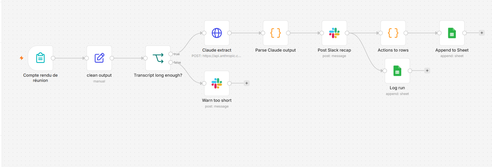

# Meeting-to-Action Assistant

An n8n + Claude workflow that turns a meeting transcript into a summary, decisions, assigned
actions and a tracking row per action in Google Sheets, then posts the recap to Slack.

**The problem.** Nobody likes writing meeting notes, so actions get lost and owners are unclear.
This workflow produces the recap in about 15 seconds and logs every action in a sheet the team
can follow, without inventing owners or deadlines that nobody stated.



## Sample output

Slack recap (excerpt) for a fictional sales meeting dated 2026-10-06:

```
Actions
• Préparer le descriptif de la maison de Sartrouville et publier l'annonce sur les portails — Marc — 2026-10-07 (high)
• Appeler le diagnostiqueur ... à faire rapidement — ⚠️ sans responsable — pas d'échéance (high)
• Préparer le modèle d'e-mail de relance et l'envoyer la semaine prochaine ... — Julie — pas d'échéance (medium)
```

The price drop to 325 000 € was discussed and then reversed in the meeting, so only the final
decision (keep 340 000 €) is recorded. "La semaine prochaine" stays `pas d'échéance` instead of
becoming an invented date.

## How it works

```
Form (title, date, participants, transcript)
        |
   Clean fields  --> word_count
        |
   Transcript long enough?  --no-->  Slack warning ("transcript too short")
        | yes
   Claude API (tool use -> structured JSON)
        |
   Parse + validate output (Code node)
        |
   Slack recap  ---->  one Google Sheet row per action
        |
        +---------->  run log (date, title, word count, actions, minutes saved)

Any failure  --> Error workflow --> Slack alert with the meeting title
```

- **Trigger:** n8n Form (title, date, participants, transcript).
- **Guard:** transcripts under a minimum word count are rejected with a clear Slack message.
- **Extraction:** HTTP Request to the Anthropic Messages API. Structured output comes from tool use
  (`save_meeting_summary`), so the result is typed JSON: `summary`, `decisions`, `actions`
  (`task`, `owner`, `due_date`, `priority`), `open_questions`.
- **Validation:** a Code node finds the `tool_use` block and merges title and date back in.
- **Outputs:** a formatted Slack recap (actions without owner or date are flagged) and one
  Sheet row per action with status `open`.
- **Usage log:** every run adds a row to a `Log` tab (date, title, word count, number of actions,
  15 minutes saved, an assumption, not a measurement) and a counter shows hours saved.
- **Errors:** a separate error workflow posts a Slack alert with the meeting title so the run can be replayed.

## Run it yourself

1. In n8n, **Import from file** both `workflow/meeting-to-action.json` and `workflow/error-handler.json`.
2. Create your own credentials (Anthropic key as a Header Auth credential named `x-api-key`, Slack, Google Sheets)
   and select them on the nodes. No secrets are stored in the exports.
3. Point the Google Sheets nodes at your own sheet (a tab for actions and a `Log` tab) and the Slack nodes at your channel.
4. In the main workflow's settings, set the error workflow to the imported handler, then publish both.

## Prompt versions

See [`prompts/v1.md`](prompts/v1.md). In short: v1 invented a precise date for
"la semaine prochaine"; v2 forces `null` for vague deadlines and keeps the wording in the task text.

## Evaluation

`eval/run_eval.py` scores the extraction against hand-written ground truth for 3 French
transcripts, each with built-in traps (a reversed price decision, a cancelled action, vague deadlines,
unowned tasks, a rambling conversation).

| Run | Action recall | Owner accuracy | Due-date accuracy | Hallucinated actions |
|---|---|---|---|---|
| Live run 1 | 14/15 (93%) | 14/14 (100%) | 14/14 (100%) | 0 |
| Live run 2 | 15/15 (100%) | 15/15 (100%) | 15/15 (100%) | 0 |

Run 1 flagged one missing action. The action was present, but the keyword matcher was too
strict about its wording. I fixed the matcher (any-of keyword groups), not the model, and re-ran: run 2.

Both runs show 1 extra action not in the ground truth (informational, not a failure).

```bash
pip install -r requirements.txt
# PowerShell:  $env:ANTHROPIC_API_KEY = "sk-ant-..."
# macOS/Linux: export ANTHROPIC_API_KEY="sk-ant-..."
python eval/run_eval.py --out eval/results/live_run.json
# or score saved n8n outputs without an API key:
python eval/run_eval.py --from-file eval/results/n8n_run_v1.json
```

The script exits with code 1 on any missing action, hallucinated action or failed decision check,
so it can run in CI.

**Caveat:** 3 transcripts is a small sample, and model output is not deterministic between runs. This
shows the method and catches regressions; it is not a statistical guarantee.

## Cost per meeting

Measured on one run of the rambling test transcript (03): **2,087 input tokens, 1,568 output tokens**
(637 of them thinking tokens). At Claude Sonnet 5.5 list price ($2 / M input, $10 / M output):

2,087 x $2/M + 1,568 x $10/M = $0.0042 + $0.0157 = **about $0.02 per meeting**.

For 20 meetings a month that is about **$0.40**. A real 45-minute meeting transcript is much longer
(my estimate: roughly 10-12k input tokens), which would give about $0.05 per meeting, around $1 a month.
Prices from the Anthropic pricing page at the time of writing.

## Privacy

The samples are fictional. Real client meetings contain personal data, so using this in production would need:
a data-processing agreement with the model provider, a decision on where transcripts and the Sheet are stored
and for how long, and a check on GDPR obligations before any real client information is sent.

## Known limits

- **Re-running a transcript appends duplicate rows** (no idempotency key yet).
- The eval uses keyword matching, which can reject a correct paraphrase.
- Minor model noise remains: some tasks keep the word "demain" in the text, and one speculative open question appears.
- Forced tool choice (`tool_choice`) is rejected by this model, so the prompt instructs it to call the tool
  and the Code node handles the extra `thinking` block.
- Very long transcripts are not chunked yet.

## Next steps (adoption)

Where the tool meets the team, which is the hard part:
- Post in the Slack channel the team already reads (done) and add a trigger from a Slack message or a shared email address.
- A one-page guide in French (written, see [`docs/guide-equipe-fr.md`](docs/guide-equipe-fr.md)): what to paste, what comes out, what the tool does not do, who to ask.
- A feedback question under each recap ("Utile ?"), logged in a second Sheet tab.
- Latency in the run log (the run log itself and the hours-saved counter are done; latency is not).
- Week one: send the recap to the meeting owner as a draft to approve before it reaches the channel.
- Find one enthusiastic colleague to try it first, run a 15-minute demo, collect 5 complaints and fix them the week after.

## Repo layout

```
workflow/   n8n exports (credentials removed)
prompts/    system prompt, tool schema, version notes
samples/    3 fictional French transcripts
eval/       run_eval.py, ground truth, results
docs/       workflow screenshot, French team guide
```

## Stack

n8n Cloud, Anthropic Messages API (tool use), Slack, Google Sheets, Python 3.
