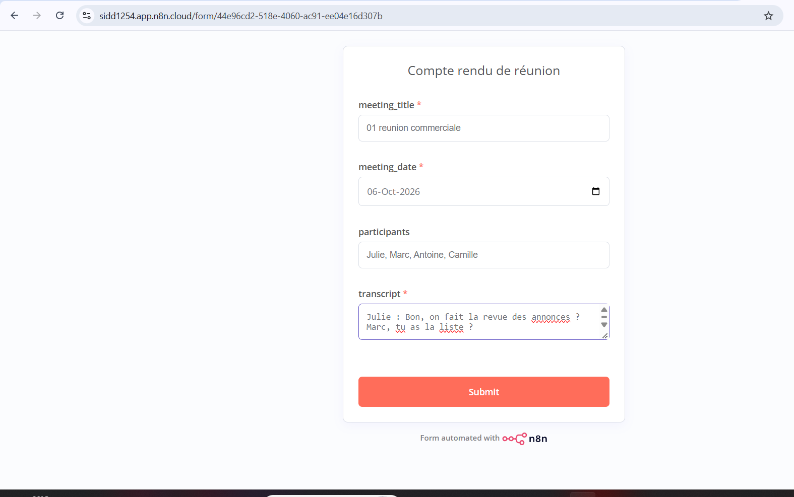
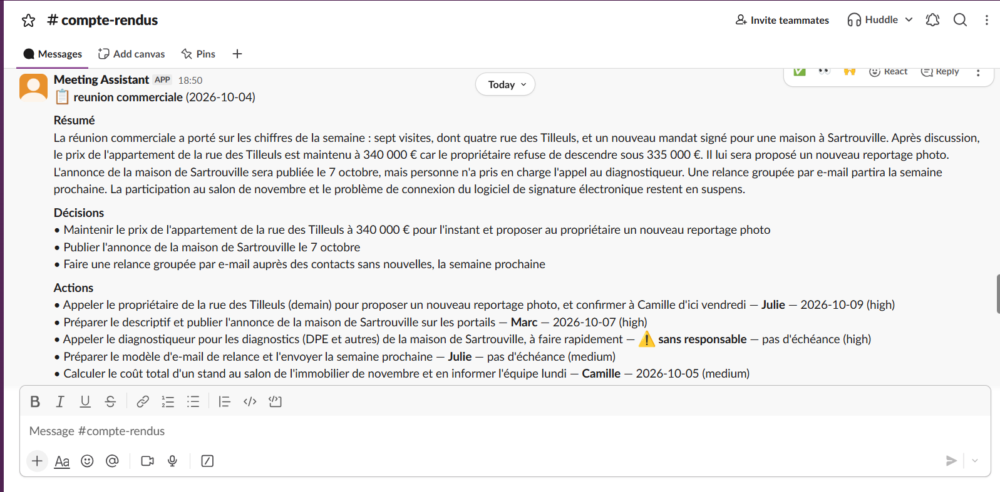
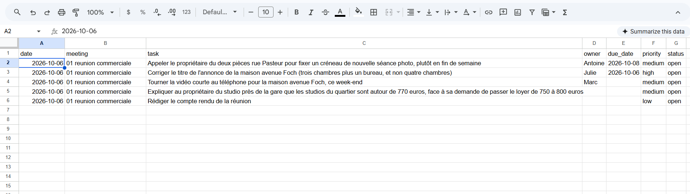

# Assistant « Compte rendu de réunion » : guide d'une page

**À quoi ça sert.** Vous collez la transcription d'une réunion, et en environ 15 secondes l'équipe reçoit dans Slack un compte rendu clair : résumé, décisions, actions avec responsable et échéance, questions ouvertes. Chaque action est aussi ajoutée dans le tableau de suivi (Google Sheets).

## Comment l'utiliser (2 minutes)

1. Ouvrez le formulaire (lien dans les messages épinglés du canal Slack).
2. Remplissez : **titre**, **date de la réunion** (au format AAAA-MM-JJ, avec la bonne année), **participants**, puis **collez la transcription**.

   

3. Cliquez sur envoyer. Le compte rendu arrive dans le canal Slack quelques secondes plus tard.

   

4. Ouvrez le tableau de suivi (lien dans le même canal) : une ligne par action, statut « open ».

   

## Ce que vous recevez

- Un **résumé** de quelques lignes.
- Les **décisions** finales (si un prix ou un choix a été changé pendant la réunion, seule la dernière version est gardée).
- Les **actions** : tâche, responsable, échéance, priorité.
- Les **questions ouvertes** : ce qui n'a pas été tranché.

## Ce que l'outil fait et ne fait pas

- Il est **conçu pour ne rien inventer** : si personne n'a pris une action, elle apparaît « ⚠️ sans responsable ». Si aucune date précise n'a été dite (« la semaine prochaine », « dès que possible »), il écrit « pas d'échéance » et garde vos mots dans la tâche.
- Il **ne remplace pas la relecture** : lisez le compte rendu avant d'agir dessus. En cas d'erreur, corrigez directement dans le tableau.
- Il **ne résume pas un audio** : il faut une transcription en texte (si elle est trop courte, un avertissement s'affiche dans Slack).
- Il **ne détecte pas les doublons** : envoyer deux fois la même réunion crée deux séries de lignes.
- **Données personnelles** : n'envoyez pas d'informations sensibles sur des clients tant que l'usage en production n'a pas été validé (accord de traitement des données, lieu de stockage).

## Si quelque chose ne marche pas

- Un message d'alerte « Échec du workflow » apparaît dans Slack : l'équipe technique est prévenue ; vous pouvez renvoyer le formulaire un peu plus tard.
- Une question, un retour, une idée : écrivez dans le canal **#compte-rendus**.

## Pour nous aider à l'améliorer

Après chaque compte rendu, dites-nous dans le fil Slack s'il a été **utile** ou non, et pourquoi. Nous collectons les premiers retours pendant une semaine, puis nous corrigeons les points les plus gênants.

*Hypothèse de gain de temps : 15 minutes économisées par compte rendu (valeur estimée, suivie dans l'onglet « Log » du tableau).*
